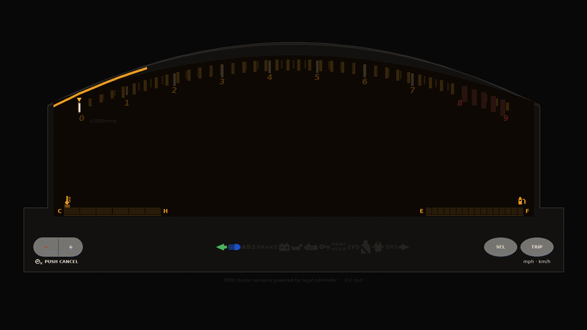
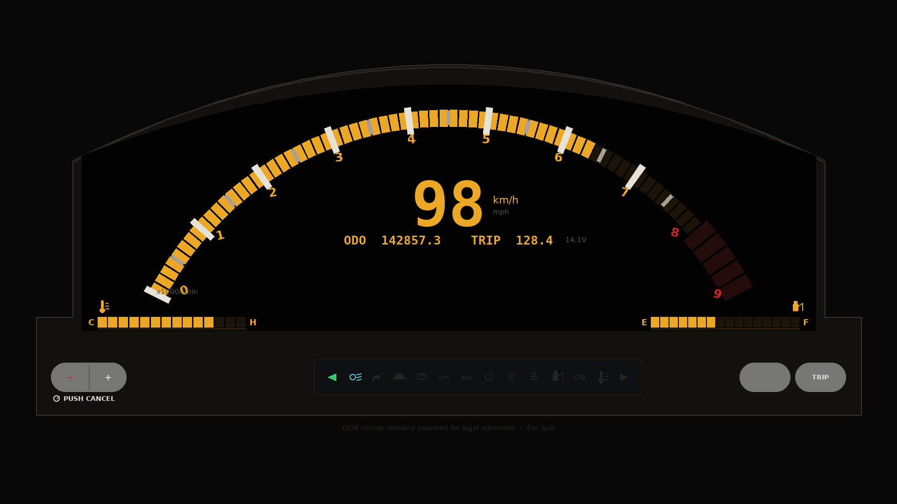
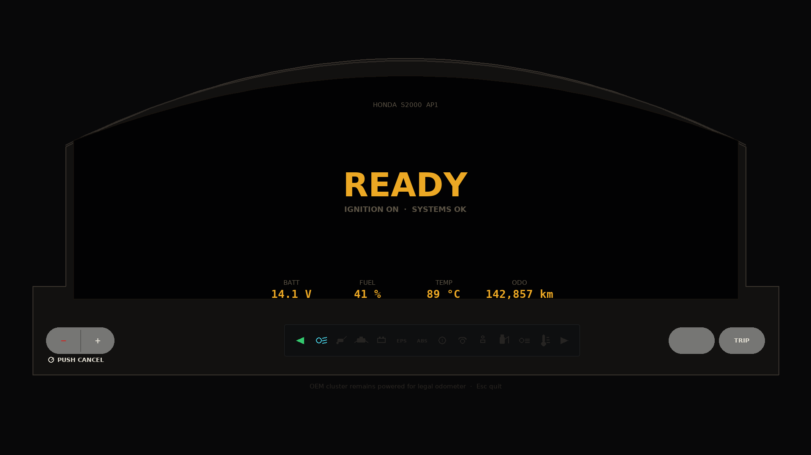
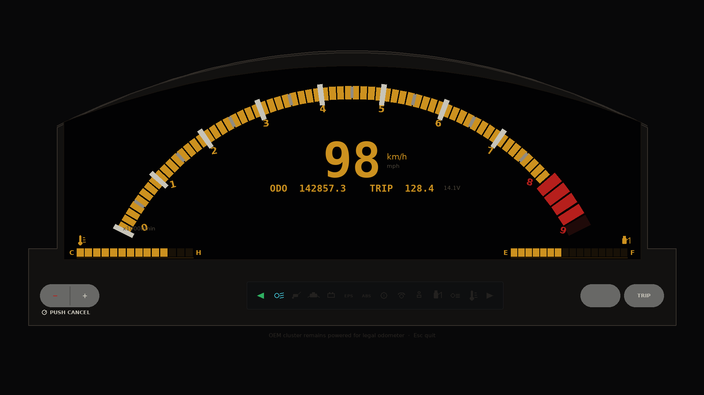
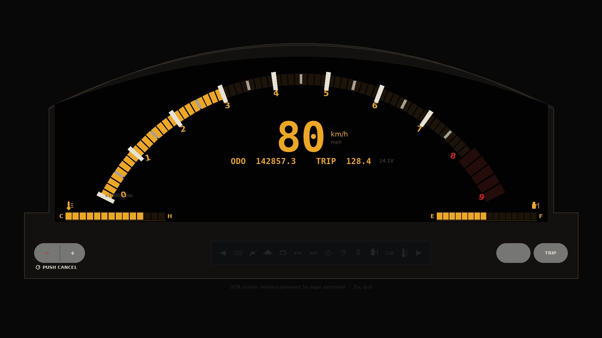
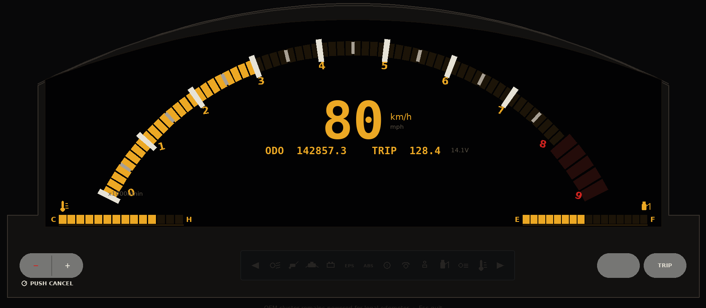

<h1 align="center">
  
  S2000 AP1 Digital Dash
</h1>

<p align="center">
  <a href="https://github.com/johnnyhuy/s2000-ap1-digital-dash/actions/workflows/ci.yml"></a>
  
  
  
  
</p>

> **Unofficial enthusiast / DIY project.** This repository is **not affiliated with, endorsed by, or associated with Honda Motor Co., Ltd.** Honda, S2000, AP1, and related marks are trademarks of their respective owners. For **personal and educational use** on the bench. The on-screen odometer is **display-only** — the **OEM cluster must stay plugged** so the factory odometer remains the legal one.

<p align="center">
  <strong>Newline JSON in. Amber AP1-geometry gauges out.</strong><br/>
  Phase 1 bench mock for a Raspberry Pi 5 + Wisecoco-class 7&quot; AMOLED overlay.<br/>
  Not a product, not car-ready, not a replacement for the factory cluster.
</p>

<p align="center">
  
</p>

<p align="center">
  <sub>Hero is a baked intro→live loop. A smaller VP9 copy lives at <a href="docs/assets/intro-live.webm"><code>docs/assets/intro-live.webm</code></a>. Stills are in <a href="shots/"><code>shots/</code></a>.</sub>
</p>

## Features

<table>
<tr>
<td width="50%" valign="middle">

### OEM-locked face

Amber-on-black LCD in a **hooded arched cowl**. Flat 2.35:1 elevation — no fake 3D skew. Proportions live in [`refs/flat/DIMENSIONS.md`](refs/flat/DIMENSIONS.md).

Arched tach **0–9 ×1000**, five redline blocks **8–9**, digital speed, horizontal **TEMP** / **FUEL**, **ODO / TRIP / BATT**.

</td>
<td width="50%">
  
</td>
</tr>
<tr>
<td width="50%" valign="middle">

### ID.4-style boot

Skippable with Space or `--no-intro`:

1. Welcome light sweep along the cowl
2. **READY** summary (batt / fuel / temp / odo)
3. Gauge reveal (tach self-test + lamp bulb-check)
4. Live

</td>
<td width="50%">
  
</td>
</tr>
<tr>
<td width="50%" valign="middle">

### Frozen JSON pipe

One object per line. Field names stay **`rpm`**, **`speed_kmh`**, **`fuel_pct`**, **`ect_c`**, **`batt_v`**, **`odo_km`**, optional **`lamps`**.

Phase 1: `mock_telemetry.py` at 20 Hz. Phase 2: the same schema over UART (`--serial`).

</td>
<td width="50%">
  
</td>
</tr>
<tr>
<td width="50%" valign="middle">

### Overlay path

The factory cluster stays powered. This UI is an overlay so the **legal odometer** keeps counting on the OEM unit.

Phase 1 is **wall power** on the bench — no ESP32, no car taps. Phase 2 will add high-Z taps later.

</td>
<td width="50%">
  
</td>
</tr>
<tr>
<td width="50%" valign="middle">

### Placeholder CAD

OpenSCAD bezel + generic connector shells in [`cad/`](cad/). **Not** AP1-accurate. Bay **callipers required** before any cabin print. **PETG or ASA — not PLA.**

</td>
<td width="50%">
  
</td>
</tr>
</table>

---

## Install

Python **3.11+**. pygame 2.5+ from `requirements.txt`. Dummy SDL is enough for tests and screenshots; a real display is only needed for the fullscreen Pi session.

```bash
git clone https://github.com/johnnyhuy/s2000-ap1-digital-dash.git
cd s2000-ap1-digital-dash
python3 -m venv .venv && source .venv/bin/activate
pip install -r requirements.txt
```

On the Pi, `export DISPLAY=:0` if the box boots headless to a desktop session.

## Run

```bash
# Bench mock pipe (repo root)
python src/mock_telemetry.py | python src/gauge_ui.py

# Same thing from src/
cd src && python mock_telemetry.py | python gauge_ui.py
```

Fullscreen by default. Esc or Q quits.

| Flag | What it does |
| --- | --- |
| `--windowed` | 1920×1080 window instead of fullscreen |
| `--intro` / `--no-intro` | Force or skip the boot sequence (intro is on unless `--smoke`) |
| `--smoke` | Dummy SDL, draw a few frames, exit (CI / Pi check; no live pipe needed) |
| `--screenshot DIR` | Write `01_sweep.png` … `05_cruise.png` into DIR |
| `--serial [PORT]` | Phase 2 UART stub (needs `pyserial`; default `/dev/ttyUSB0`) |

```bash
# Fast health check (same commands CI runs)
python -m unittest discover tests
SDL_VIDEODRIVER=dummy python src/gauge_ui.py --smoke

# Rebuild stills
python src/gauge_ui.py --smoke --screenshot shots

# Rebuild stills + intro GIF/WebM (needs ffmpeg)
python scripts/bake_showcase.py
```

Stdin is newline JSON. Phase 2 UART is the same schema on `--serial`.

## Protocol

See [`src/protocol.py`](src/protocol.py). **Do not rename fields.**

Required: `rpm`, `speed_kmh`, `fuel_pct`, `ect_c`, `batt_v`, `odo_km`

Optional: `lamps` object (`oil`, `cel`, `abs`, `turn_l`, `turn_r`, `high_beam`, `fog`, `fuel_low`, `batt_warn`, `ect_hot`, …)

## Layout

- `src/protocol.py` — shared schema + parse/validate
- `src/mock_telemetry.py` — 20 Hz fake drive loop → stdout
- `src/gauge_ui.py` — pygame 1920×1080 OEM-geometry cluster + intro
- `src/serial_reader.py` — Phase 2 UART stub (pyserial optional)
- `refs/flat/` — SVG + `DIMENSIONS.md` lock for the OEM face
- `cad/` — OpenSCAD placeholders (bezel + generic connector shells)
- `shots/` — sweep / ready / reveal / live / cruise stills
- `docs/assets/` — unofficial mark, intro GIF, VP9 hero
- `scripts/bake_showcase.py` — regenerate stills + hero media
- `.github/workflows/ci.yml` — unittest + headless smoke on push/PR to `main`

## CAD placeholders

See [`cad/README.md`](cad/README.md). The 7" bezel and connector shells are dimensional guesses for a wall-powered bench (Pi 5 + 7" AMOLED). They are **not** Honda drop-ins.

- Callipers required before any cabin print
- Print **PETG or ASA**, never PLA in a sun-soaked dash
- No STLs committed — export locally from OpenSCAD

## Disclaimer

This is an **unofficial** enthusiast / DIY bench project.

- **Not affiliated with, endorsed by, or associated with Honda Motor Co., Ltd.**
- Honda, S2000, AP1, and related names are trademarks of their respective owners
- Personal / educational use only
- The overlay odometer is **display-only**. Keep the **OEM cluster plugged** for the legal odometer
- Phase 1 is not vehicle wiring. Do not treat placeholder CAD as production geometry
- The title icon is an original geometric **H**, not Honda Motor Co. trademark artwork

## Community

Bench notes and Phase 2 tap ideas belong in [Issues](https://github.com/johnnyhuy/s2000-ap1-digital-dash/issues). Keep protocol field names stable so mock, UI, and a future UART source stay interchangeable.

This is a small overlay experiment, not a product landing page. If the face geometry drifts, the lock file in `refs/flat/` wins.
